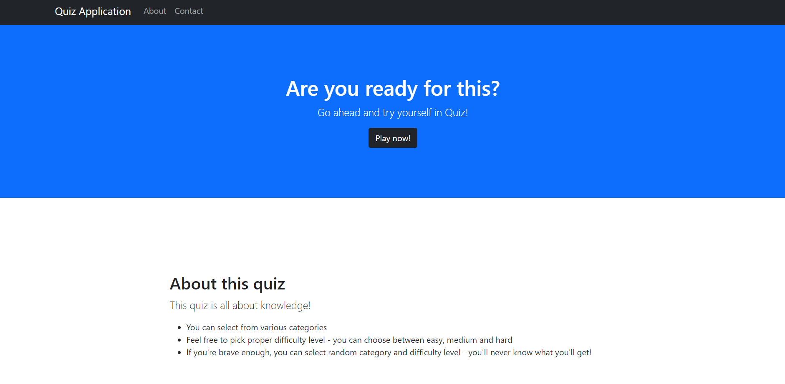
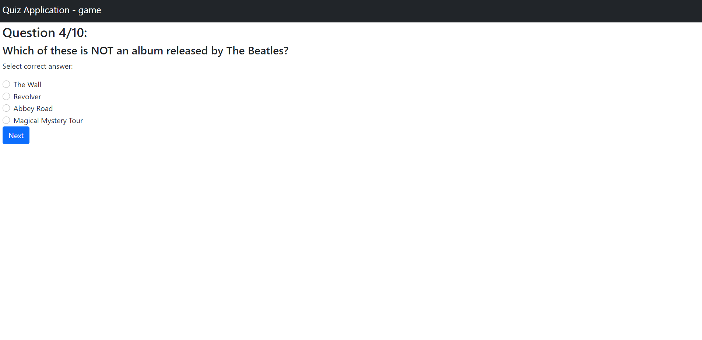
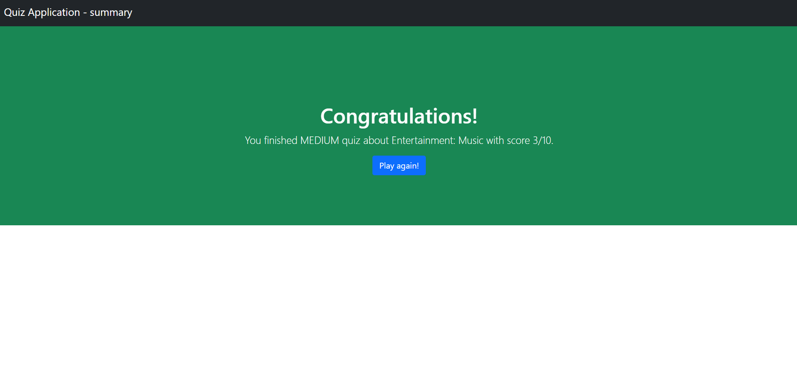

# Quiz App

### Check your knowledge!

## TABLE OF CONTENTS

* [About this quiz](#about-this-quiz)
* [Screenshots from app](#screenshots-from-app)
* [Technologies](#technologies)
* [How to start](#how-to-start)

## About this quiz

* You can select from various categories
*  Feel free to pick proper difficulty level - you can choose between easy, medium and hard
*  If you're brave enough, you can select random category and difficulty level - you'll never know what you'll get!

## Screenshots from app

#### Home page

#### Game page

#### Summary page

## Technologies

* JAVA 11
* Spring Boot 2.5.4
* Lombok 1.18.20
* Junit5 5.7.2
* AssertJ 3.19.0

## How to start

* Run command line and type following commands:

1.`
git clone https://github.com/igor-on/quiz-app.git && cd quiz-app
`

2.`
mvn clean compile package && cd target && java -jar Quiz-1.0.0.jar
`

